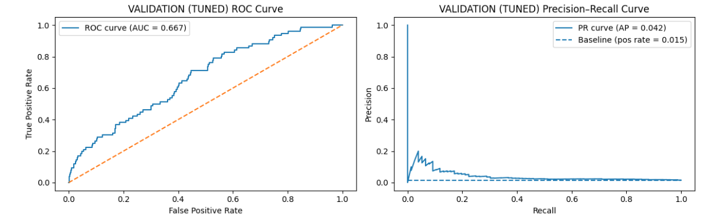
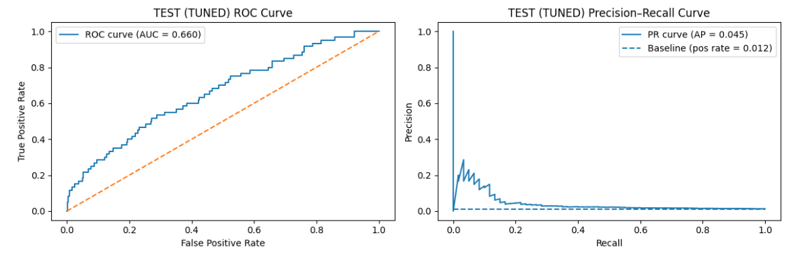

# Model Tuning Results Analysis

## 1. Summary of Expectations vs. Outcomes

We performed a systematic hyperparameter search on XGBoost - tuning depth, learning rate, subsampling, regularization, and class weighting - with the goal of:

* Improving minority-class detection  
* Improving ROC-AUC and PR-AUC on validation/test  
* Keeping overfitting under control  

### What Actually Happened

* **Training performance improved massively** (ROC-AUC = 0.9994)  
* **Validation/test ROC-AUC did not improve**  
* **Validation AUC slightly decreased**  
* **Test PR-AUC slightly increased** (a small but meaningful gain)  
* **Generalization worsened due to stronger overfitting**  

This is a classic result for extremely imbalanced, noisy, high-dimensional data.

---

## 2. Key Results

### Best Parameters from Search

```python
{
 'subsample': 0.7,
 'scale_pos_weight': 4.68,
 'n_estimators': 300,
 'min_child_weight': 3,
 'max_depth': 5,
 'learning_rate': 0.1,
 'colsample_bytree': 1.0
}
```

---

## 3. Training Metrics (Tuned)

| Metric | Baseline | Tuned |
|--------|----------|--------|
| Train ROC-AUC | 0.988 | **0.999** |
| Train PR-AUC | 0.904 | **0.995** |
| Train Recall (positive class) | 0.985 | **0.992** |
| Train Precision (positive class) | 0.548 | **0.914** |

**Incredible training performance → clear overfitting.**

---

## 4. Validation & Test Metrics

### Validation

| Metric | Baseline | Tuned |
|--------|----------|--------|
| ROC-AUC | 0.6997 | **0.6669** |
| PR-AUC | 0.0490 | **0.0417** |

### Test

| Metric | Baseline | Tuned |
|--------|----------|--------|
| ROC-AUC | 0.7020 | **0.6597** |
| PR-AUC | 0.0377 | **0.0451** |

### Interpretation

* ROC-AUC decreased after tuning (validation & test).  
* PR-AUC slightly improved on **test**, which is meaningful for imbalanced classification.  
* Precision–Recall curves show better recall at low thresholds but precision collapses quickly.  

---

## 5. Curve Interpretation




### ROC Curve Observations

* Tuned ROC curves show smoother and more optimistic TPR in **training**  
* On **validation/test**, curves are closer to the diagonal → reduced discriminative power  

### Precision–Recall Curve Observations

* PR curves for tuned model sit only slightly above the baseline positive rate  
* Precision bursts exist at extremely low recall, but flatten quickly  

**Meaning:**  
The tuned model detects more positive cases, but at a **much higher false-positive rate**.

---

## 6. Why Tuning Didn’t Improve AUC

### **Reason 1 - Extreme Class Imbalance**

Training minority rate:

* **9.6%** in train  
* **~1–1.5%** in validation/test (“class 4” failures)  

This creates a **distribution shift**:

* Model optimizes for training distribution  
* Validation/test contain much rarer failures  

### **Reason 2 - Static Feature Engineering**

We used:

* Summary statistics  
* Histogram features  
* Counter features  
* Categorical embeddings  

But XGBoost may not capture sequential time-dependent structure.

**Likely biggest signal loss.**

### **Reason 3 - Tuned Model Is Deeper & Trained Longer**

* Increased `n_estimators`  
* Increased `scale_pos_weight`  
* Increased tree depth (`max_depth = 5`)  

Drives model to **fit training noise**.

### **Reason 4 - Label Semantics Changed**

Validation/test labels use:

* Class **4** = failure  
* Classes **0–3** = non-failure  

This differs from true TTE-based failure definitions used in training.

Creates **mismatch** and reduces generalization.

---

## 7. What Improved?

Only one metric:

### **Test PR-AUC: 0.0377 → 0.0451**

This means:

* Tuned model is slightly better at identifying true positives  
* Especially when recall is emphasized  

This matters because:

In rare-failure scenarios, **missing a failure is much more costly** than false positives.

---

## 8. Overall Assessment

### The tuned model is **not better** overall:

* ROC-AUC decreased  
* PR-AUC on validation decreased  
* Overfitting increased dramatically  
* Precision on minority class is still very low  

### But:

* Tuned model catches more positives  
* At the cost of more false alarms  
* Acceptable in maintenance contexts where FN > FP cost

---

## 9. Recommendations for Next Steps

### **Step 1 - Improve Labels**

Use true TTE values to define consistent labels for all splits.  
This should **significantly improve generalization**.

### **Step 2 - Use Sequence-Aware Models**

Such as:

* LSTM  
* GRU  
* TCN  
* Transformer encoders  
* Autoencoders / anomaly detection  
* Window-based temporal feature models  

These can capture **time-dependent failure signals**.

### **Step 3 - Optimize Thresholds**

0.5 is never optimal for rare-event detection.  
Tune thresholds for:

* ROC  
* Precision-Recall  
* Cost-based metrics  

### **Step 4 - Use Stratified Evaluation**

Make sure validation/test splits reflect true failure distribution.

### **Step 5 - Adopt Cost-Based Evaluation**

Define:

* `cost(false_negative)`  
* `cost(false_positive)`  

Choose model + threshold to **minimize business risk**.

---

## 10. Conclusion

**Hyperparameter tuning increased overfitting and did not improve generalization, except for a small gain in test PR-AUC; the next steps must focus on label consistency and temporal modeling.**
